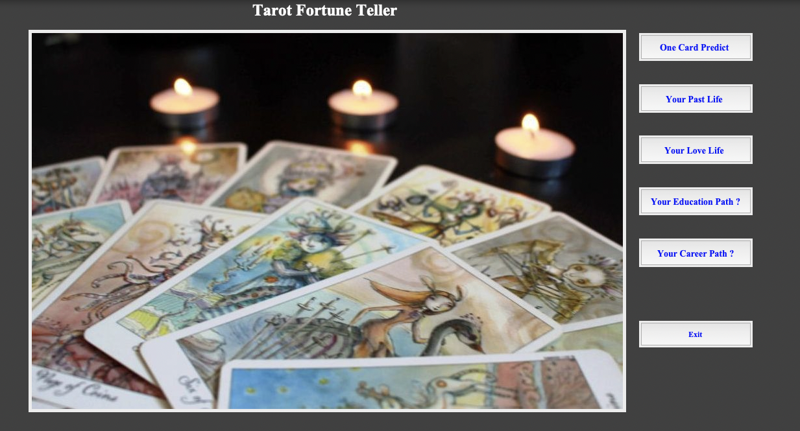

# Tarot Matching using Python 

The is the project of matching Tarot to predict future using Python,Tkinter library for GUI. This project is aim to attract people and student for the interest in IT and Programming languages.
Created in 2023 July.

## Installation requirements
You need to download python and Tkinter.

```bash
  pip install -r requirements.txt
```
    
## How to run the app

```bash
  python3 main.py
```
    
## Screenshot




## License

[MIT](https://choosealicense.com/licenses/mit/)


## Badges


[](https://choosealicense.com/licenses/mit/)

